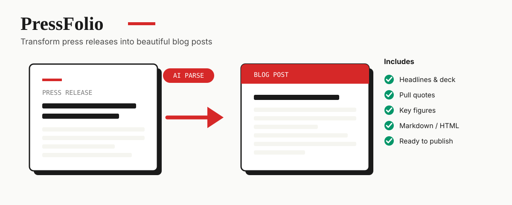
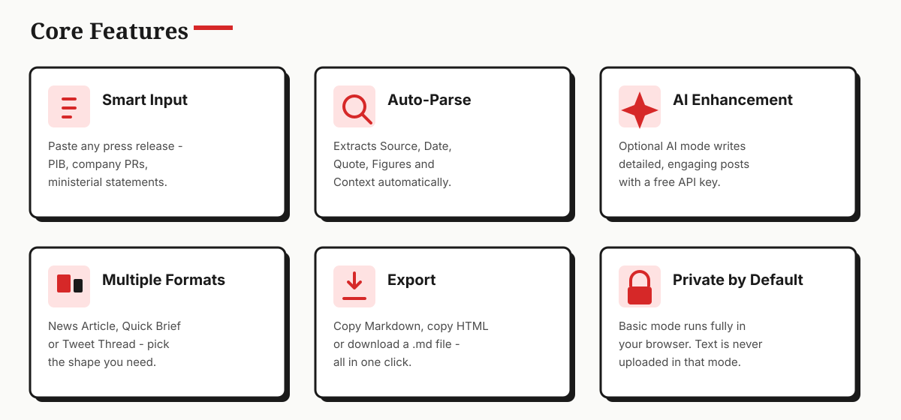
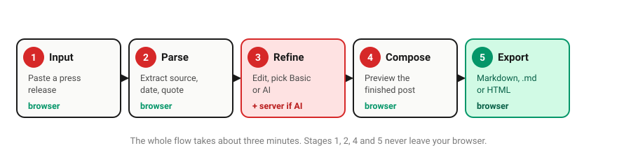
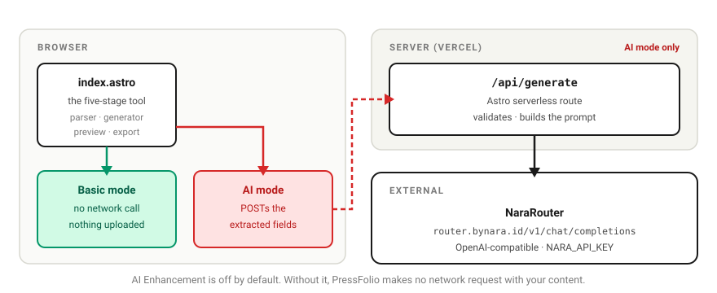
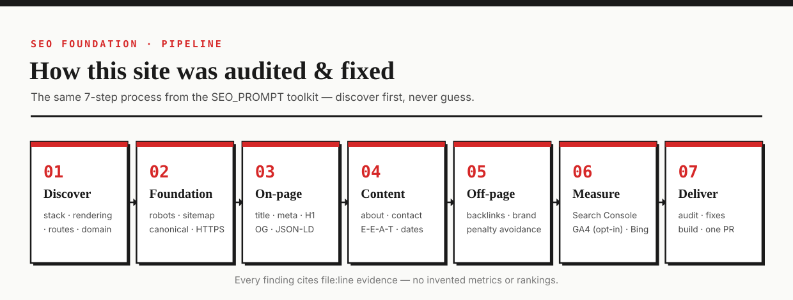
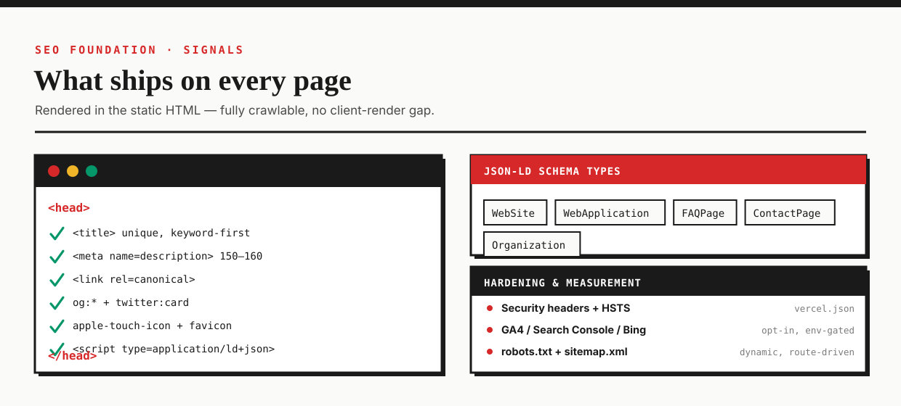

<div align="center">

# 📰 PressFolio

### Transform Press Releases into Beautiful Blog Posts — in seconds

<a href="https://pressfolio.vercel.app"></a>
<a href="https://astro.build"></a>
<a href="LICENSE"></a>


<br/>



</div>

---

## 🧭 What is PressFolio?

**PressFolio** is a free, browser-based tool that turns dry, official **press releases** into clean,
well-structured **blog posts**. Paste a release, let PressFolio pull out the who / what / when /
why, tidy it up, and export it as Markdown or HTML — ready for your CMS.

It runs in two modes:

| Mode | What it does | Needs an API key? | Where it runs |
|------|--------------|-------------------|---------------|
| ⚡ **Basic (Quick)** | Fast, deterministic formatting | ❌ No | 🖥️ Entirely in your browser |
| ✨ **AI Enhanced** | Writes detailed, engaging prose | ✅ Yes (free key) | ☁️ Server route → AI provider |

> 💡 **Privacy first:** in Basic mode everything happens locally. Your text is never uploaded.

### 👥 Perfect for

| | Who | Why they use it |
|---|-----|-----------------|
| 🗞️ | **Journalists** | Turn PIB releases into readable articles fast |
| ✍️ | **Bloggers** | Repurpose official statements into engaging posts |
| 📊 | **Analysts** | Pull out the key figures and quotes without manual reading |
| 📱 | **Social media managers** | Spin a release into a tweet thread |

---

## ✨ Features at a glance

<div align="center">

</div>

<details>
<summary><b>Full feature table</b> (click to expand)</summary>

| Feature | Description |
|---------|-------------|
| 📥 Smart Input | Paste any press release — PIB, company PRs, ministerial statements |
| 🔍 Auto-Parse | Automatically extracts **Source, Date, Quote, Figures, Context** |
| ✏️ Refine | Edit and customise the extracted content before composing |
| 🤖 AI Enhancement | Optional GPT-powered detailed blog post generation |
| 📰 Multiple Formats | Generate a **News Article**, **Quick Brief**, or **Tweet Thread** |
| 📤 Export | Copy **Markdown**, copy **HTML**, or download a `.md` file |
| 🌗 Dark Mode | Built-in light/dark theme toggle |
| 💾 Auto-Save | Drafts are saved automatically in the browser |
| 🔒 Private by Default | Basic mode never leaves your device |

</details>

---

## 🔄 How it works — the 5-stage workflow

<div align="center">

</div>

<table>
<tr><th>#</th><th>Stage</th><th>What happens</th></tr>
<tr><td>1️⃣</td><td><b>Input</b></td><td>Paste your raw press release into the editor.</td></tr>
<tr><td>2️⃣</td><td><b>Parse</b></td><td>PressFolio detects the source, date, headline, quotes and figures.</td></tr>
<tr><td>3️⃣</td><td><b>Refine</b></td><td>Fix anything, pick a format, and choose <i>Basic</i> or <i>AI</i> generation.</td></tr>
<tr><td>4️⃣</td><td><b>Compose</b></td><td>See a live preview of the finished post.</td></tr>
<tr><td>5️⃣</td><td><b>Export</b></td><td>Copy or download the result as Markdown / HTML.</td></tr>
</table>

---

## 🤖 AI Enhancement (optional)

PressFolio's AI mode is **free to try** and works with any OpenAI-compatible endpoint.
The default recipe below uses **NaraRouter**.

| Feature | Details |
|---------|---------|
| 🎁 Daily tokens | 7 million **free** |
| ⏱️ Rate limit | 10 requests / minute |
| 🧠 Models | 52+ available |
| 💳 Credit card | Not required |
| 🔗 Sign up | [nara.id](https://nara.id) |

**Enable it in 5 steps:**

1. 🔑 Sign up at [nara.id](https://nara.id) with Google and copy your free API key.
2. ☁️ Deploy to Vercel (see below).
3. ⚙️ Add the environment variable `NARA_API_KEY` in your Vercel project.
4. 🔁 Redeploy.
5. ✨ Toggle **AI Enhancement** on in Stage 3.

---

## 🏗️ Architecture

<div align="center">

</div>

- The **browser** renders the editor and does all Basic-mode formatting locally.
- **Astro SSR on Vercel** serves the pages and the `/api/generate` route.
- The **AI provider** is only contacted in AI mode.

---

## 🧰 Tech stack

| Layer | Choice |
|-------|--------|
| 🚀 Framework | [Astro 4](https://astro.build) (SSR, `output: 'server'`) |
| ☁️ Hosting / Adapter | [Vercel](https://vercel.com) via `@astrojs/vercel` |
| 🤖 AI | NaraRouter (OpenAI-compatible, free tier) |
| 🎨 Styling | Vanilla CSS with CSS variables (no framework) |
| 🔤 Fonts | Playfair Display · Inter · JetBrains Mono |

---

## 🚀 Quick start

```bash
# 1. Clone
git clone https://github.com/NSKWeb/pressfolio.git
cd pressfolio

# 2. Install dependencies
npm install

# 3. Run the dev server  →  http://localhost:4321
npm run dev

# 4. Build for production
npm run build

# 5. Preview the build
npm run preview
```

> 🧩 **Node:** Astro 4 works best on Node 18/20. A newer Node will still build but Vercel's
> functions target Node 20.

---

## ☁️ Deployment (Vercel)

1. Push the repo to GitHub.
2. Import it in [Vercel](https://vercel.com/new).
3. Set **Framework Preset = Astro**.
4. (Optional, for AI mode) Add environment variables:

   | Variable | Required | Description |
   |----------|----------|-------------|
   | `NARA_API_KEY` | Only for AI mode | Free key from [nara.id](https://nara.id) |

5. Deploy.

The Astro Vercel adapter writes to `.vercel/output` using the Build Output API — you do **not**
need to set an output directory.

---

## 📁 Project structure

```
pressfolio/
├── 📂 src/
│   ├── 📂 pages/
│   │   ├── index.astro              # 🏠 The main tool
│   │   ├── api/generate.ts          # 🤖 AI generation endpoint
│   │   ├── how-it-works.astro       # 📖 Tutorial
│   │   ├── contact.astro            # ✉️  Contact form
│   │   ├── privacy.astro            # 🔐 Privacy policy
│   │   ├── terms.astro              # 📜 Terms of service
│   │   ├── 404.astro                # 🚧 Not-found page
│   │   └── sitemap.xml.ts           # 🗺️  Dynamic sitemap
│   ├── 📂 layouts/
│   │   └── BaseLayout.astro         # 🧱 Base layout + <head> SEO
│   ├── 📂 components/
│   │   ├── Header.astro             # 🔝 Header
│   │   └── Footer.astro             # 🔻 Footer
│   └── 📂 styles/
│       └── global.css               # 🎨 Global styles
├── 📂 public/
│   ├── robots.txt                   # 🤖 Crawler rules
│   ├── favicon.svg                  # ⭐ Favicon
│   └── og-image.png                 # 🖼️  Social share image
├── 📂 assets/                       # 📊 README infographics (SVG)
├── astro.config.mjs                 # ⚙️  Astro + Vercel adapter
├── vercel.json                      # ⚙️  Headers & HSTS
└── package.json
```

---

## 🎨 Design system

<div align="center">

| Token | Light | Dark |
|-------|-------|------|
| 🔴 Primary | `#D62828` | `#EF4444` |
| ⬜ Background | `#FAFAF8` | `#0F0F0F` |
| 🃏 Card | `#FFFFFF` | `#252525` |
| ⬛ Border | `#1A1A1A` | `#FAFAFA` |

</div>

The look is **neo-brutalist**: hard black borders, offset solid shadows, high contrast, and a
restrained red accent.

**Typography**

| Use | Font |
|-----|------|
| Headings | **Playfair Display** |
| Body | **Inter** |
| Code | **JetBrains Mono** |

---

## 🔍 SEO & search visibility

PressFolio ships with a solid technical SEO foundation — and it is the **canonical home of the
reusable toolkit** behind it. The toolkit lives in its own repository at
**[NSKWeb/SEO_PROMPT](https://github.com/NSKWeb/SEO_PROMPT)** and has since been applied to
other NSKWeb projects.

<p align="center">
  
</p>

**Technical foundation**

- 🤖 `robots.txt` + a **dynamic `sitemap.xml`** (`src/pages/sitemap.xml.ts`) generated from the route list
- 🔗 **Canonical tags**, unique titles & meta descriptions, consistent URL structure
- 🛡️ **Security headers + HSTS** via `vercel.json`
- 📱 Mobile-first Astro output (static HTML — fully crawlable, no client-render gap)

**On-page SEO**

- 📣 **Open Graph + Twitter cards**, an `og-image.png`, favicon, and `apple-touch-icon`
- 🧩 **JSON-LD structured data** — `WebSite`, `WebApplication`, `FAQPage`, `ContactPage`, and `Organization`
- 🖼️ Descriptive `alt` text on every illustration
- 🔗 Internal links between the tool, How-it-works, Contact, Privacy, and Terms pages

<p align="center">
  
</p>

**Content & E-E-A-T**

- 📖 About / how-it-works, contact, privacy, and terms pages establish ownership and trust

**Measurement (opt-in, env-gated)**

- 📈 Optional **GA4** plus Google Search Console / Bing verification — enabled only when the matching env vars are set

**Audit & strategy**

- 📄 [`SEO_AUDIT.md`](SEO_AUDIT.md) — the full pass/fail audit with `file:line` evidence
- 🗺️ [`SEO_STRATEGY.md`](SEO_STRATEGY.md) — the off-page / authority plan

**The toolkit**

- 📝 [`SEO_PROMPT.md`](SEO_PROMPT.md) — a copy-paste SEO prompt for any AI agent (OpenHands, Copilot, Cursor…)
- 🧠 [`.agents/skills/seo-audit/SKILL.md`](.agents/skills/seo-audit/SKILL.md) — an OpenHands skill that runs the audit automatically
- 🌐 Mirrored at **[NSKWeb/SEO_PROMPT](https://github.com/NSKWeb/SEO_PROMPT)** for reuse across projects

To use it in another repo, copy the skill folder in and tell your agent:

```bash
cp -r .agents/skills/seo-audit <target-repo>/.agents/skills/
```

> _Then: “Run the seo-audit skill on this repo.”_

---

## 🤝 Contributing

Contributions are welcome! 🙌

1. 🍴 Fork the repo
2. 🌿 Create a branch: `git checkout -b feature/my-change`
3. 💾 Commit your changes
4. 🚀 Push and open a Pull Request

---

## 📜 License

Released under the [MIT License](LICENSE). © NSKWeb

---

## 🙏 Acknowledgments

- [Astro](https://astro.build) — the web framework
- [Vercel](https://vercel.com) — hosting & serverless
- [NaraRouter](https://nara.id) — free AI API
- Inspired by [PIB Dispatcher](https://presstoblog.netlify.app)

---

<div align="center">

### ⭐ If PressFolio saves you time, give it a star!

Made with ❤️ by <a href="https://github.com/NSKWeb">NSKWeb</a>

</div>
