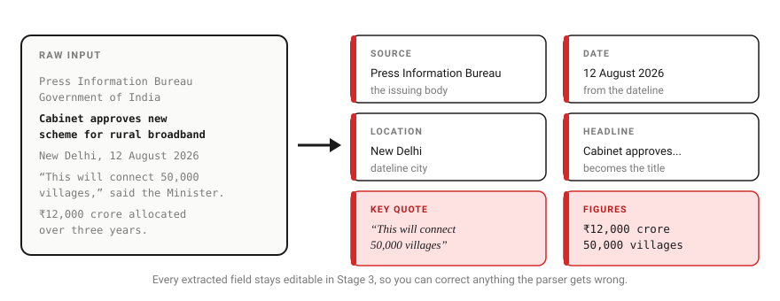
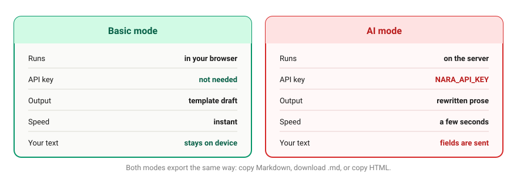
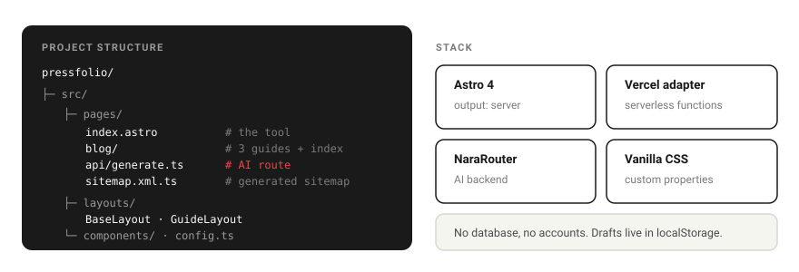

# PressFolio

### Turn any press release into a publish-ready blog post.


**PressFolio** is a free, browser-based tool that converts official press releases into
formatted blog posts. Paste a release, let it extract the source, date, location, quote and
figures, then export the result as Markdown, a `.md` file, HTML, or a tweet thread.

There is no account, no database, and no signup. The core conversion runs entirely in your
browser; the optional AI step is the only part that talks to a server.

---

## Contents

- [How it works](#how-it-works)
- [What the parser extracts](#what-the-parser-extracts)
- [Basic mode vs AI mode](#basic-mode-vs-ai-mode)
- [Architecture](#architecture)
- [Project structure](#project-structure)
- [Quick start](#quick-start)
- [Deployment](#deployment)
- [Configuration reference](#configuration-reference)
- [Design system](#design-system)
- [Troubleshooting](#troubleshooting)
- [Contributing](#contributing)
- [License](#license)

---

## How it works


*The five-stage pipeline. Stages 1, 2, 4 and 5 never leave the browser. Only Stage 3 can
reach the server, and only when you explicitly pick AI mode.*

PressFolio breaks the conversion into five stages, each one a panel in the interface:

| Stage | Name | What happens | Where it runs |
|:-----:|------|--------------|---------------|
| **1** | **Input** | Paste the raw press release text. | Browser |
| **2** | **Parse** | Extraction pulls out source, date, location, headline, quote, figures and context. | Browser |
| **3** | **Refine** | Every extracted field is editable. Choose Basic (local template) or AI (server) generation, and pick the output format. | Browser, or server if AI |
| **4** | **Compose** | Preview the finished post with the extracted values rendered in place. | Browser |
| **5** | **Export** | Copy Markdown, download a `.md` file, or copy HTML for WordPress, Medium or Ghost. | Browser |

The whole flow takes about three minutes. Because the parsing and the Basic generation path
are pure client-side JavaScript, the tool keeps working if the AI backend is unavailable —
you simply lose the AI rewrite, not the converter.

---

## What the parser extracts



*Six fields are pulled from the raw release text. Each stays editable in Stage 3, so anything
the parser gets wrong can be corrected before you generate.*

| Field | Drawn from | Used for |
|-------|-----------|----------|
| **Source** | The issuing body, e.g. Press Information Bureau | Attribution line and the `Source:` footer |
| **Date** | The dateline | Normalised into the exported post |
| **Location** | The dateline city | Dateline and context |
| **Headline** | The release title | Becomes the post's `##` title |
| **Key quote** | Quoted statements | Rendered as a blockquote |
| **Figures** | Numeric claims, budgets, targets | Rendered as a bullet list |

Parsing is tuned for official announcement formats: PIB releases, company press releases,
ministerial statements, and similar. Extraction is heuristic rather than exhaustive, which is
exactly why every field is presented for editing rather than written straight to the output.

---

## Basic mode vs AI mode



*The two generation paths. Basic mode is local and private; AI mode sends the extracted fields
to a server for rewriting.*

| | **Basic mode** | **AI mode** |
|---|---|---|
| **Runs** | In your browser | On the server (`/api/generate`) |
| **API key** | Not needed | `NARA_API_KEY` required |
| **Output** | Deterministic, template-based draft | Longer, rewritten prose |
| **Speed** | Instant | A few seconds |
| **Your text** | Never leaves the device | Extracted fields are sent to NaraRouter |

Both modes export identically. AI Enhancement is **off by default** — if you never enable it,
PressFolio makes no network request containing your content.

> **Privacy note:** in AI mode the extracted fields (title, source, date, location, quote,
> figures, context) are sent to NaraRouter to generate the post. Do not enable AI mode for
> material you are not permitted to share with a third-party API.

---

## Architecture


*Two paths out of `index.astro`. The Basic path is a closed loop inside the browser. The AI path
crosses into the Vercel serverless function, which holds the API key and calls NaraRouter.*

- **`index.astro`** — the entire five-stage tool. Parsing, Basic generation, preview and export
  are client-side. Drafts are persisted to `localStorage` under `pressfolio-draft`.
- **`api/generate.ts`** — an Astro serverless route (`prerender = false`). It validates input,
  builds a format-specific prompt, and calls the OpenAI-compatible NaraRouter endpoint.
- **`NARA_API_KEY`** — read from the server environment. The key is never exposed to the
  browser; if a visitor supplies their own key it is used per-request instead.
- **NaraRouter** — the external AI provider, at `router.bynara.id/v1/chat/completions`.

---

## Project structure



*Routes, layouts, components and supporting modules, alongside the stack and the "no backend
state" design decision.*

```
pressfolio/
├── assets/                      # README diagrams (SVG)
├── public/
│   ├── favicon.svg
│   ├── apple-touch-icon.png
│   ├── og-image.png
│   ├── robots.txt
│   └── llms.txt
├── scripts/
│   └── generate-brand-assets.py # regenerates the icon and OG image
├── src/
│   ├── pages/
│   │   ├── index.astro          # the five-stage tool
│   │   ├── api/generate.ts      # AI generation route
│   │   ├── how-it-works.astro
│   │   ├── press-release-to-blog-post.astro
│   │   ├── pr-content-repurposing.astro
│   │   ├── announcement-to-blog.astro
│   │   ├── blog/                # index + three guides
│   │   ├── sitemap.xml.ts       # generated sitemap
│   │   ├── contact.astro
│   │   ├── privacy.astro
│   │   └── terms.astro
│   ├── layouts/
│   │   ├── BaseLayout.astro     # head, theme, shared shell
│   │   └── GuideLayout.astro    # long-form guide pages
│   ├── components/
│   │   ├── Header.astro
│   │   ├── Footer.astro
│   │   └── ContentSections.astro
│   ├── config.ts                # SITE constants, indexable pages
│   ├── schema.ts                # JSON-LD structured data
│   └── styles/global.css        # design tokens, light + dark
├── astro.config.mjs
├── vercel.json
└── package.json
```

---

## Quick start

```bash
git clone https://github.com/NSKWeb/pressfolio.git
cd pressfolio
npm install
npm run dev      # http://localhost:4321
```

To try AI mode locally, create a `.env` file in the project root:

```bash
NARA_API_KEY=your_key_here
```

Get a free key at [nara.id](https://nara.id) — sign up with Google, no credit card. Basic mode
works without any key at all.

| Command | Does |
|---------|------|
| `npm run dev` | Start the dev server with hot reload |
| `npm run build` | Production build |
| `npm run preview` | Preview the built output |

---

## Deployment

### Vercel (recommended)

1. Push the repository to GitHub.
2. Import it at [vercel.com/new](https://vercel.com/new).
3. Add an environment variable named `NARA_API_KEY` with your key from
   [nara.id](https://nara.id).
4. Deploy.

### Environment variables

| Variable | Required | Description |
|----------|:--------:|-------------|
| `NARA_API_KEY` | For AI mode | NaraRouter key, free at [nara.id](https://nara.id). Without it, Basic mode still works and AI mode returns a clear 401. |

> **Build note:** this project uses `output: 'server'` with the Vercel adapter, so Astro writes
> its build to `.vercel/output` (Build Output API v3). `dist/` is not produced by a fresh build
> — do not point `outputDirectory` at it, and do not commit build output or `node_modules`.

---

## Configuration reference

### API — `POST /api/generate`

| Field | Type | Required | Notes |
|-------|------|:--------:|-------|
| `title` | string | ✅ | Post title |
| `context` | string | ✅ | Supporting context; also used for validation |
| `source` | string | | Issuing body |
| `date` | string | | Publication date |
| `location` | string | | Dateline city |
| `quote` | string | | Key statement |
| `figures` | string | | Numeric claims |
| `format` | string | | `article` (default), `brief`, or `thread` |
| `model` | string | | Defaults to `nara/nara-1-20251101` |
| `apiKey` | string | | Optional per-request override of `NARA_API_KEY` |

A `GET /api/generate` request returns a self-describing JSON document listing these fields.

**Responses:** `200` success with `content`, `wordCount`, `provider` and `tokensUsed`;
`400` missing title or context; `401` missing or invalid key; `500` upstream failure.

---

## Design system

### Colours

| Token | Light | Dark |
|-------|-------|------|
| Accent | `#D62828` | `#EF4444` |
| Background | `#FAFAF8` | `#0F0F0F` |
| Card | `#FFFFFF` | `#252525` |
| Text | `#1A1A1A` | `#FAFAFA` |
| Border | `#1A1A1A` | `#FAFAFA` |
| Success | `#059669` | `#10B981` |

### Typography

- **Headings** — Playfair Display
- **Body** — Inter
- **Code** — JetBrains Mono

Theming is driven by a `data-theme` attribute on `<html>`, defaulting to the visitor's
`prefers-color-scheme` and persisted under `pressfolio-theme` in `localStorage`.

---

## Troubleshooting

| Symptom | Cause | Fix |
|---------|-------|-----|
| `API key not configured` (401) | `NARA_API_KEY` unset | Add it in Vercel → Settings → Environment Variables, then redeploy |
| `Invalid NaraRouter API key` (401) | Key wrong or revoked | Reissue at [nara.id](https://nara.id) |
| AI generation fails (500) | Upstream NaraRouter error or rate limit | Retry; the free tier allows 10 requests/minute |
| AI mode unavailable, Basic works | Expected fallback | The converter is client-side; only the AI rewrite needs the backend |
| Fields parsed incorrectly | Heuristic extraction | Edit them in Stage 3 before generating |

---

## Contributing

Contributions are welcome — please open a pull request. If you change anything under
`src/pages/`, check `src/config.ts` and `src/schema.ts` too, since page listings and JSON-LD
structured data are kept there rather than inline.

---

## License

MIT. See [LICENSE](LICENSE).

---

## Acknowledgments

- [Astro](https://astro.build) — the web framework
- [NaraRouter](https://nara.id) — the AI backend
- [Vercel](https://vercel.com) — hosting and serverless functions
- Inspired by [PIB Dispatcher](https://presstoblog.netlify.app)

## Contact

Questions or bugs: [open an issue](https://github.com/NSKWeb/pressfolio/issues)
